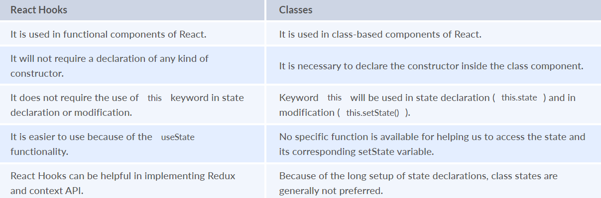

## React Interview Questions and Answers
#### 1. **What is React?**
**Answer:** React is a front-end and open-source JavaScript library which is useful in developing user interfaces specifically for applications with a single page. It is helpful in building complex and reusable user interface(UI) components of mobile and web applications as it follows the component-based approach.
The important features of React are:
- It supports server-side rendering.
- It will make use of the virtual DOM rather than real DOM (Data Object Model) as RealDOM manipulations are expensive.
- It follows unidirectional data binding or data flow.
- It uses reusable or composable UI components for developing the view.

#### 2. **What are the advantages of using React?**
**Answer:** MVC is generally abbreviated as Model View Controller.
- **Use of Virtual DOM to improve efficiency:** React uses virtual DOM to render the view. As the name suggests, virtual DOM is a virtual representation of the real DOM. Each time the data changes in a react app, a new virtual DOM gets created. Creating a virtual DOM is much faster than rendering the UI inside the browser. Therefore, with the use of virtual DOM, the efficiency of the app improves.
- **Gentle learning curve:** React has a gentle learning curve when compared to frameworks like Angular. Anyone with little knowledge of javascript can start building web applications using React.
- **SEO friendly:** React allows developers to develop engaging user interfaces that can be easily navigated in various search engines. It also allows server-side rendering, which boosts the SEO of an app.
- **Reusable components:** React uses component-based architecture for developing applications. Components are independent and reusable bits of code. These components can be shared across various applications having similar functionality. The re-use of components increases the pace of development.
- **Huge ecosystem of libraries to choose from:** React provides you with the freedom to choose the tools, libraries, and architecture for developing an application based on your requirement.

#### 3. **What are the limitations of React?**
**Answer:** The few limitations of React are as given below:
- React is not a full-blown framework as it is only a library.
- The components of React are numerous and will take time to fully grasp the benefits of all.
- It might be difficult for beginner programmers to understand React.
- Coding might become complex as it will make use of inline templating and JSX.

#### 4. **What are the limitations of React?**
**Answer:** The few limitations of React are as given below:

Example of a list using key:
```
const ids = [1,2,3,4,5];
const listElements = ids.map((id)=>{
return(
<li key={id.toString()}>
  {id}
</li>
)
})
```
**Importance of keys -**
- Keys help react identify which elements were added, changed or removed.
- Keys should be given to array elements for providing a unique identity for each element.
- Without keys, React does not understand the order or uniqueness of each element.
- With keys, React has an idea of which particular element was deleted, edited, and added.
- Keys are generally used for displaying a list of data coming from an API.

> Note- Keys used within arrays should be unique among siblings. They need not be globally unique.

#### 5. **What is JSX?**
**Answer:** JSX stands for JavaScript XML. It allows us to write HTML inside JavaScript and place them in the DOM without using functions like appendChild( ) or createElement( ).
As stated in the official docs of React, JSX provides syntactic sugar for React.createElement( ) function.
> Note- We can create react applications without using JSX as well.
Let’s understand how JSX works:
Without using JSX, we would have to create an element by the following process:
```
const text = React.createElement('p', {}, 'This is a text');
const container = React.createElement('div','{}',text );
ReactDOM.render(container,rootElement);
```
Using JSX, the above code can be simplified:
```
const container = (
<div>
  <p>This is a text</p>
</div>
);
ReactDOM.render(container,rootElement);
```
As one can see in the code above, we are directly using HTML inside JavaScript.

#### 6. **What are the differences between functional and class components?**
**Answer:** Before the introduction of Hooks in React, functional components were called stateless components and were behind class components on a feature basis. After the introduction of Hooks, functional components are equivalent to class components.

Although functional components are the new trend, the react team insists on keeping class components in React. Therefore, it is important to know how these components differ.

On the following basis let’s compare functional and class components:

- **Declaration**
Functional components are nothing but JavaScript functions and therefore can be declared using an arrow function or the function keyword:
```
function card(props){
   return(
      <div className="main-container">
        <h2>Title of the card</h2>
      </div>
    )
   }
   const card = (props) =>{
    return(
      <div className="main-container">
        <h2>Title of the card</h2>
      </div>
    )
   }
```
Class components, on the other hand, are declared using the ES6 class:
```
class Card extends React.Component{
  constructor(props){
     super(props);
   }
    render(){
      return(
        <div className="main-container">
          <h2>Title of the card</h2>
        </div>
      )
    }
   }
```

- **Handling props**
Let’s render the following component with props and analyse how functional and class components handle props:
> &lt;Student Info name="Vivek" rollNumber="23" /&gt;

In functional components, the handling of props is pretty straightforward. Any prop provided as an argument to a functional component can be directly used inside HTML elements:
```
function StudentInfo(props){
   return(
     <div className="main">
       <h2>{props.name}</h2>
       <h4>{props.rollNumber}</h4>
     </div>
   )
 }
```
In the case of class components, props are handled in a different way:
```
class StudentInfo extends React.Component{
   constructor(props){
     super(props);
    }
    render(){
      return(
        <div className="main">
          <h2>{this.props.name}</h2>
          <h4>{this.props.rollNumber}</h4> 
        </div>
      )
    }
   }
```
As we can see in the code above, this keyword is used in the case of class components.

- **Handling state**
Functional components use React hooks to handle state. It uses the useState hook to set the state of a variable inside the component:
```
function ClassRoom(props){
   let [studentsCount,setStudentsCount] = useState(0);
    const addStudent = () => {
      setStudentsCount(++studentsCount);
   }
    return(
      <div>
        <p>Number of students in class room: {studentsCount}</p>
        <button onClick={addStudent}>Add Student</button>
      </div>
    )
   }
```
Since useState hook returns an array of two items, the first item contains the current state, and the second item is a function used to update the state.

In the code above, using array destructuring we have set the variable name to studentsCount with a current value of “0” and setStudentsCount is the function that is used to update the state.

For reading the state, we can see from the code above, the variable name can be directly used to read the current state of the variable.

We cannot use React Hooks inside class components, therefore state handling is done very differently in a class component:

Let’s take the same above example and convert it into a class component:
```
class ClassRoom extends React.Component{
        constructor(props){
            super(props);
            this.state = {studentsCount : 0};
            
            this.addStudent = this.addStudent.bind(this);
         }
            
            addStudent(){
            this.setState((prevState)=>{
               return {studentsCount: prevState.studentsCount++}
            });
         }
            
            render(){
             return(
               <div>
                 <p>Number of students in class room: {this.state.studentsCount}</p>
                 <button onClick={this.addStudent}>Add Student</button>
               </div>
             )
           }
         } 
```
In the code above, we see we are using this.state to add the variable studentsCount and setting the value to “0”.

For reading the state, we are using this.state.studentsCount.

For updating the state, we need to first bind the addStudent function to this. Only then, we will be able to use the setState function which is used to update the state. 


#### 7. **What is the virtual DOM? How does react use the virtual DOM to render the UI?**
**Answer:** As stated by the react team, virtual DOM is a concept where a virtual representation of the real DOM is kept inside the memory and is synced with the real DOM by a library such as ReactDOM.

**Why was virtual DOM introduced?**
DOM manipulation is an integral part of any web application, but DOM manipulation is quite slow when compared to other operations in JavaScript. The efficiency of the application gets affected when several DOM manipulations are being done. Most JavaScript frameworks update the entire DOM even when a small part of the DOM changes.

For example, consider a list that is being rendered inside the DOM. If one of the items in the list changes, the entire list gets rendered again instead of just rendering the item that was changed/updated. This is called inefficient updating.

To address the problem of inefficient updating, the react team introduced the concept of virtual DOM.
**How does it work?**

For every DOM object, there is a corresponding virtual DOM object(copy), which has the same properties. The main difference between the real DOM object and the virtual DOM object is that any changes in the virtual DOM object will not reflect on the screen directly. Consider a virtual DOM object as a blueprint of the real DOM object. Whenever a JSX element gets rendered, every virtual DOM object gets updated.
> Note- One may think updating every virtual DOM object might be inefficient, but that’s not the case. Updating the virtual DOM is much faster than updating the real DOM since we are just updating the blueprint of the real DOM.
React uses two virtual DOMs to render the user interface. One of them is used to store the current state of the objects and the other to store the previous state of the objects. Whenever the virtual DOM gets updated, react compares the two virtual DOMs and gets to know about which virtual DOM objects were updated. After knowing which objects were updated, react renders only those objects inside the real DOM instead of rendering the complete real DOM. This way, with the use of virtual DOM, react solves the problem of inefficient updating.

#### 8. **What are the differences between controlled and uncontrolled components?**
**Answer:** Controlled and uncontrolled components are just different approaches to handling input from elements in react.

- **Controlled component:** In a controlled component, the value of the input element is controlled by React. We store the state of the input element inside the code, and by using event-based callbacks, any changes made to the input element will be reflected in the code as well.
When a user enters data inside the input element of a controlled component, onChange function gets triggered and inside the code, we check whether the value entered is valid or invalid. If the value is valid, we change the state and re-render the input element with the new value.
Example of a controlled component:
```
function FormValidation(props) {
let [inputValue, setInputValue] = useState("");
let updateInput = e => {
  setInputValue(e.target.value);
};
return (
  <div>
    <form>
      <input type="text" value={inputValue} onChange={updateInput} />
    </form>
  </div>
);
}
```
As one can see in the code above, the value of the input element is determined by the state of the inputValue variable. Any changes made to the input element is handled by the updateInput function.

- **Uncontrolled component:** In an uncontrolled component, the value of the input element is handled by the DOM itself. Input elements inside uncontrolled components work just like normal HTML input form elements.
The state of the input element is handled by the DOM. Whenever the value of the input element is changed, event-based callbacks are not called. Basically, react does not perform any action when there are changes made to the input element.

Whenever use enters data inside the input field, the updated data is shown directly. To access the value of the input element, we can use ref.

Example of an uncontrolled component:
```
function FormValidation(props) {
let inputValue = React.createRef();
let handleSubmit = e => {
  alert(`Input value: ${inputValue.current.value}`);
  e.preventDefault();
};
return (
  <div>
    <form onSubmit={handleSubmit}>
      <input type="text" ref={inputValue} />
      <button type="submit">Submit</button>
    </form>
  </div>
);
}
```
As one can see in the code above, we are not using onChange function to govern the changes made to the input element. Instead, we are using ref to access the value of the input element. 

#### 9. **What are the different phases of the component lifecycle?**
**Answer:** There are four different phases in the lifecycle of React component.
They are:
- **Initialization:** During this phase, React component will prepare by setting up the default props and initial state for the upcoming tough journey.
- **Mounting:** Mounting refers to putting the elements into the browser DOM. Since React uses VirtualDOM, the entire browser DOM which has been currently rendered would not be refreshed. This phase includes the lifecycle methods componentWillMount and componentDidMount.
- **Updating:** In this phase, a component will be updated when there is a change in the state or props of a component. This phase will have lifecycle methods like componentWillUpdate, shouldComponentUpdate, render, and componentDidUpdate.
- **Unmounting:** In this last phase of the component lifecycle, the component will be removed from the DOM or will be unmounted from the browser DOM. This phase will have the lifecycle method named componentWillUnmount.


#### 10. **What are the lifecycle methods of React?**
**Answer:** React lifecycle hooks will have the methods that will be automatically called at different phases in the component lifecycle and thus it provides good control over what happens at the invoked point. It provides the power to effectively control and manipulate what goes on throughout the component lifecycle.

For example, if you are developing the YouTube application, then the application will make use of a network for buffering the videos and it consumes the power of the battery (assume only these two). After playing the video if the user switches to any other application, then you should make sure that the resources like network and battery are being used most efficiently. You can stop or pause the video buffering which in turn stops the battery and network usage when the user switches to another application after video play.

So we can say that the developer will be able to produce a quality application with the help of lifecycle methods and it also helps developers to make sure to plan what and how to do it at different points of birth, growth, or death of user interfaces.

The various lifecycle methods are:
- **constructor():** This method will be called when the component is initiated before anything has been done. It helps to set up the initial state and initial values.
- **getDerivedStateFromProps():** This method will be called just before element(s) rendering in the DOM. It helps to set up the state object depending on the initial props. The getDerivedStateFromProps() method will have a state as an argument and it returns an object that made changes to the state. This will be the first method to be called on an updating of a component.
- **render():** This method will output or re-render the HTML to the DOM with new changes. The render() method is an essential method and will be called always while the remaining methods are optional and will be called only if they are defined.
- **componentDidMount():** This method will be called after the rendering of the component. Using this method, you can run statements that need the component to be already kept in the DOM.
- **shouldComponentUpdate():** The Boolean value will be returned by this method which will specify whether React should proceed further with the rendering or not. The default value for this method will be True.
- **getSnapshotBeforeUpdate():** This method will provide access for the props as well as for the state before the update. It is possible to check the previously present value before the update, even after the update.
- **componentDidUpdate():** This method will be called after the component has been updated in the DOM.
- **componentWillUnmount():** This method will be called when the component removal from the DOM is about to happen.

#### 11. **Explain about types of Hooks in React.**
**Answer:** There are two types of Hooks in React. They are:
**1. Built-in Hooks:** The built-in Hooks are divided into 2 parts as given below:
- **Basic Hooks:**
  - **useState():** This functional component is used to set and retrieve the state.
  - **useEffect():** It enables for performing the side effects in the functional components.
  - **useContext():** It is used for creating common data that is to be accessed by the components hierarchy without having to pass the props down to each level.
- **Additional Hooks:**
  - **useReducer():** It is used when there is a complex state logic that is having several sub-values or when the upcoming state is dependent on the previous state. It will also enable you to optimization of component performance that will trigger deeper updates as it is permitted to pass the dispatch down instead of callbacks.
  - **useMemo():** This will be used for recomputing the memoized value when there is a change in one of the dependencies. This optimization will help for avoiding expensive calculations on each render.
  - **useCallback():** This is useful while passing callbacks into the optimized child components and depends on the equality of reference for the prevention of unneeded renders.
  - **useImperativeHandle():**  It will enable modifying the instance that will be passed with the ref object.
  - **useDebugValue():** It is used for displaying a label for custom hooks in React DevTools.
  - **useRef():** It will permit creating a reference to the DOM element directly within the functional component.
  - **useLayoutEffect():** It is used for the reading layout from the DOM and re-rendering synchronously.

**2. Custom Hooks:** A custom Hook is basically a function of JavaScript. The Custom Hook working is similar to a regular function. The “use” at the beginning of the Custom Hook Name is required for React to understand that this is a custom Hook and also it will describe that this specific function follows the rules of Hooks. Moreover, developing custom Hooks will enable you for extracting component logic from within reusable functions.


#### 12. **Differentiate React Hooks vs Classes.**
**Answer:**


#### 13. **How does the performance of using Hooks will differ in comparison with the classes?**
**Answer:**
- React Hooks will avoid a lot of overheads such as the instance creation, binding of events, etc., that are present with classes.
- Hooks in React will result in smaller component trees since they will be avoiding the nesting that exists in HOCs (Higher Order Components) and will render props which result in less amount of work to be done by React.


#### 14. **What is React Router?**
**Answer:** React Router refers to the standard library used for routing in React. It permits us for building a single-page web application in React with navigation without even refreshing the page when the user navigates. It also allows to change the browser URL and will keep the user interface in sync with the URL. React Router will make use of the component structure for calling the components, using which appropriate information can be shown. Since React is a component-based framework, it’s not necessary to include and use this package. Any other compatible routing library would also work with React.

The major components of React Router are given below:
- **BrowserRouter:** It is a router implementation that will make use of the HTML5 history API (pushState, popstate, and event replaceState) for keeping your UI to be in sync with the URL. It is the parent component useful in storing all other components.
- **Routes:** It is a newer component that has been introduced in the React v6 and an upgrade of the component.
- **Route:** It is considered to be a conditionally shown component and some UI will be rendered by this whenever there is a match between its path and the current URL.
- **Link:** It is useful in creating links to various routes and implementing navigation all over the application. It works similarly to the anchor tag in HTML.

